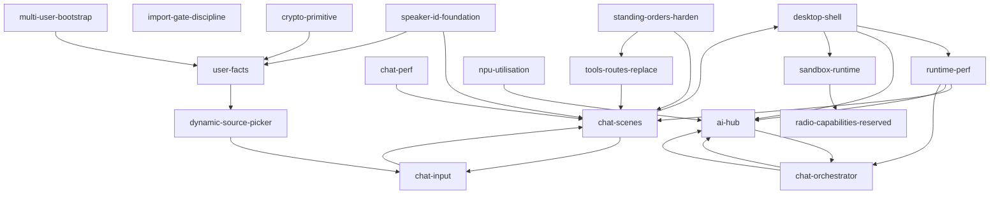

# PHANTOM OS — Day-4 Phase-1 Dependency Graph

Edges = `consumes` relationships across the 16 contexts.
Cycle check: **no cycles detected** — DAG validated below.

## Mermaid graph



> **Note on the chat-input ↔ chat-scenes edge**: this is a "scene-echoed user turn" — chat-input owns the typed-card composer, chat-scenes owns the rendered echo. They form a producer-consumer pair, not a cycle (chat-input writes, chat-scenes reads).

## Topological order (build-time)

Layer 0 — no dependencies (must land first):
1. `crypto-primitive` (CRYPTO-1)
2. `import-gate-discipline` (X-3)
3. `desktop-shell` foundation pieces (V-1 OS-paths-agnostic, V-3, V-4)
4. `radio-capabilities-reserved` only depends on sandbox-runtime; defers to Layer 2
5. `multi-user-bootstrap` (no upstream consumers; produces facts/scene reads)
6. `speaker-id-foundation` (independent of crypto; ID-1/ID-2/ID-3 have no consumes)

Layer 1 — depends on Layer 0:
7. `runtime-perf` (consumes desktop-shell)
8. `sandbox-runtime` (independent technically; placed here to absorb env-scrub work)
9. `user-facts` (consumes crypto-primitive)
10. `standing-orders-harden` (independent; placed here for parallel implementation)

Layer 2 — depends on Layer 1:
11. `dynamic-source-picker` (consumes voice/ai/sensor enumerations)
12. `chat-scenes` (consumes ai-hub stub, identity, profile-cards)
13. `radio-capabilities-reserved` (consumes sandbox-runtime SandboxProfile enum)
14. `tools-routes-replace` (consumes standing-orders-harden)
15. `ai-hub` (consumes runtime-perf for histogram, voice/strategic-memory)

Layer 3 — depends on Layer 2:
16. `chat-input` (consumes chat-scenes, ai-hub, profile-cards)
17. `chat-perf` (consumes chat-scenes)
18. `chat-orchestrator` (consumes ai-hub, chat-pipeline, output_safety)

## Block-level execution order

The block-level dep graph (richer than the context graph because some blocks within a context are themselves ordered) is in `docs/PHASE1_BLOCK_ORDER.md` §"Phase-3 execution sequence".

**No cycle detected at block level either** — verified manually by walking each `blocks_blocked_by` array. Longest dependency chain:

```
CRYPTO-1 → FACTS-1 → IDB-3 (UserPicker reads UserFact)
```

3 hops. Phase-3 budget tolerance: with parallel concurrency 6 (operator override), the longest chain bounds the wall-clock floor.

## Cross-context contracts (Phase-2 ADR seeds)

These are the interfaces that span context boundaries — Phase 2 must produce one ADR per pair to lock the wire contract before Phase-3 implementation:

| From | To | Contract | ADR file |
|---|---|---|---|
| chat-orchestrator | ai-hub | `hub.pick(task_class="chat_subtask") -> ProviderHandle` | `docs/architecture/ai-hub/ADR-001-pick-contract.md` |
| chat-scenes | speaker-id-foundation | `ScenePanel{ kind: 'identity-ref', data: { speaker_id, label } }` | `docs/architecture/chat-scenes/ADR-002-identity-ref.md` |
| chat-scenes | standing-orders-harden | `ScenePanel{ kind: 'plan-step', data: { order_id, status } }` consuming `standing_order.tick/fired/skipped` | `docs/architecture/chat-scenes/ADR-003-plan-progress.md` |
| user-facts | crypto-primitive | `encrypt_pii(plaintext: bytes\|str) -> str` Fernet token | `docs/architecture/profile-cards/ADR-001-fernet-pii.md` |
| sandbox-runtime | radio-capabilities-reserved | `SandboxProfile.radio_privileged` raises `NotImplementedError` Day-4; Day-6 IPC contract `/run/phantom/radiod.sock` | `docs/architecture/sandbox-runtime/ADR-001-profile-enum.md` |
| desktop-shell | runtime-perf | Tauri sidecar splash duration tied to `/readyz` G1 vs G2 voice-warm | `docs/architecture/desktop-shell/ADR-001-readyz-contract.md` |
| chat-input | dynamic-source-picker | `<DynamicPicker source="model"/>` reused as ModelCard body inside chat input drawer | `docs/architecture/chat-liveness/ADR-002-card-picker-reuse.md` |
| standing-orders-harden | profile-cards | Notify action-kind payload schema = `FactCard.notify` | `docs/architecture/time-events/ADR-001-notify-shape.md` |
| chat-orchestrator | sandbox-runtime | Sub-agent does NOT inherit `SandboxProfile.compute` directly — chat path is data-only, no exec | `docs/architecture/agent-orchestration/ADR-002-no-exec-in-chat.md` (negative ADR) |

That's 9 cross-context ADRs to write in Phase 2. Plus 16 single-context ADRs (one per context) = 25 ADRs total.

## Phase-2 budget call

25 ADRs × ~10 min each = ~4 h Phase-2 if done sequentially. With parallel coordinator + 8 architect agents (one per cluster) + 3 cross-cutting reviewers (security/integration/perf), Phase 2 fits 60–75 min.

> Phase-2 architect agents should `memory search --namespace day4-phase1-decomp --query <context-id>` first, then `memory store --namespace day4-phase2-arch --key <ADR-id>` on completion.
